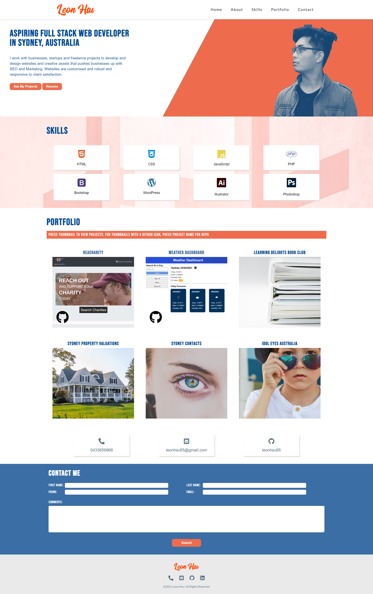

# Leon Hsu Portfolio

You can view my Portfolio here: [Leon Hsu Portfolio](https://leonhsu95.github.io/leonhsu95-portfolio/)

## Table of Contents

- [Description](#description)
- [Usage](#usage)
- [Credits](#credits)
- [License](#license)

## Description

The website is a portfolio page that demonstrates my skills as a web developer 
as of current. In the website, it contains my bio, contact information and projects that I worked on that show my development experience.

## Technologies

Technologies used in this portfolio include:
 * HTML
 * CSS
 * JS and cdns for animation
 * Photoshop
 * Illustrator

## Usage

My portfolio should look like this, please do not recreate or reuse under any circumstances without permission:

 

## Credits

Project developed by Leon Hsu. Copyright 2021 Leon Hsu leonhsu95. All Rights Reserved.

## License
MIT License

Copyright (c) [2021] [leonhsu95]

Permission is hereby granted, free of charge, to any person obtaining a copy
of this software and associated documentation files (the "Software"), to deal
in the Software without restriction, including without limitation the rights
to use, copy, modify, merge, publish, distribute, sublicense, and/or sell
copies of the Software, and to permit persons to whom the Software is
furnished to do so, subject to the following conditions:

The above copyright notice and this permission notice shall be included in all
copies or substantial portions of the Software.

THE SOFTWARE IS PROVIDED "AS IS", WITHOUT WARRANTY OF ANY KIND, EXPRESS OR
IMPLIED, INCLUDING BUT NOT LIMITED TO THE WARRANTIES OF MERCHANTABILITY,
FITNESS FOR A PARTICULAR PURPOSE AND NONINFRINGEMENT. IN NO EVENT SHALL THE
AUTHORS OR COPYRIGHT HOLDERS BE LIABLE FOR ANY CLAIM, DAMAGES OR OTHER
LIABILITY, WHETHER IN AN ACTION OF CONTRACT, TORT OR OTHERWISE, ARISING FROM,
OUT OF OR IN CONNECTION WITH THE SOFTWARE OR THE USE OR OTHER DEALINGS IN THE
SOFTWARE.

## Features

- The website is mobile first and responsive.
- Animation triggers on HTML elements on mouse scroll.
- Potential Employers can view all of my projects, skill proficiencies and contact details.

## Future Improvements
- The site can be more dynamic in animation and can take inspiration from awwwards.com websites.
- Contact Form can have js regex for validation and website can be hosted and turned into php to make Contact Form work.

## Tests

Website is validated with [HTML Markup Validation Tool](https://validator.w3.org/), [CSS Validation Service](https://jigsaw.w3.org/css-validator/) and [JS Validation Service](https://jshint.com/).
